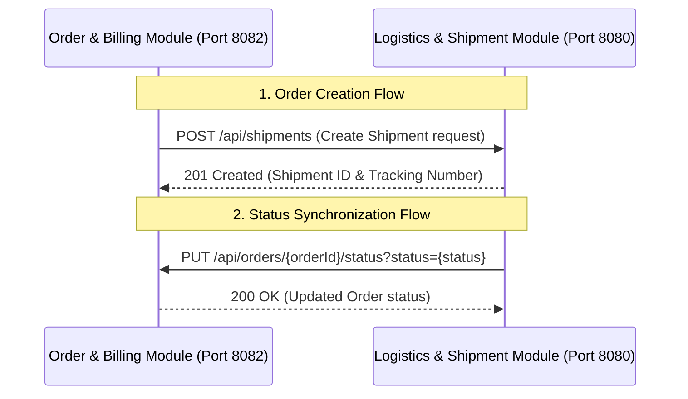

# 🔌 Module Integration & Cross-Module Communication Guide

**Owner**: Randil  
**Focus Area**: System Integration, Configuration (`application.properties`), Order Sync Endpoint, and Postman Cross-Module Verification.

---

## 📋 Integration Overview

This module governs the inter-service integration (cross-module communication) between the **Logistics & Shipment Module** (port `8080`) and the **Order & Billing Module** (port `8082`).



---

## ⚙️ 1. Configurations (`application.properties`)

In a microservices or modular architecture, configuring endpoints dynamically is critical to avoid hardcoding.

### Backend Configurations
Located at: `LogesticAndShipmentModule/backend/src/main/resources/application.properties`

```properties
# Port definition
server.port=8080

# Database configurations with fallback
spring.datasource.url=${SPRING_DATASOURCE_URL:jdbc:mysql://localhost:3306/logistics_db?useSSL=false&serverTimezone=UTC&allowPublicKeyRetrieval=true&createDatabaseIfNotExist=true}
spring.datasource.username=${SPRING_DATASOURCE_USERNAME:root}
spring.datasource.password=${SPRING_DATASOURCE_PASSWORD:}

# Microservices URLs for inter-service REST integration
integration.order-service.url=${INTEGRATION_ORDER_SERVICE_URL:http://localhost:8082}
```

### Explanation for the Lecturer:
*   **Default and Environment Fallbacks**: Using the `${VAR_NAME:default_value}` syntax allows the application to run seamlessly in local standalone mode using defaults, while also allowing Docker Compose or Kubernetes to override them using environment variables (`SPRING_DATASOURCE_URL`, `INTEGRATION_ORDER_SERVICE_URL`) without modifying the codebase.
*   **Cross-Module Dependency**: `integration.order-service.url` specifies the base URL of the Order and Billing module so the Logistics service knows where to send status updates.

---

## 🔄 2. Order Sync Endpoint & REST Flow

The communication flow is bidirectional, implemented using Spring Boot's `RestTemplate` client.

### Flow A: Order Module triggers Shipment Creation (Incoming)
When a customer creates an order, the Order module automatically registers a shipment in the Logistics module.
*   **REST Endpoint**: `POST http://localhost:8080/api/shipments`
*   **Code Reference**: `OrderServiceImpl.java` makes a POST call to Logistics.
*   **Request Body (JSON)**:
    ```json
    {
      "orderId": 12,
      "customerId": 105,
      "deliveryAddress": "123 University Ave, Colombo",
      "courierName": "FastTrack Logistics"
    }
    ```
*   **Logistics Action**: Automatically generates a tracking number, sets status to `PENDING`, and saves it.

### Flow B: Logistics Module updates Order Status (Outgoing/Sync)
When the logistics manager changes a shipment's status (e.g. from `IN_TRANSIT` to `DELIVERED`), the Logistics backend automatically synchronizes this state with the Order backend.
*   **REST Endpoint**: `PUT http://localhost:8082/api/orders/{orderId}/status?status={status}`
*   **Code Reference**: `ShipmentServiceImpl.java` maps internal shipment statuses to order statuses:
    *   `DELIVERED` ➔ `COMPLETED`
    *   `CANCELLED` ➔ `CANCELLED`
    *   `PENDING` ➔ `PENDING`
    *   `PACKED` / `DISPATCHED` / `IN_TRANSIT` / `OUT_FOR_DELIVERY` ➔ `SHIPPED`
*   **REST Call Execution**:
    ```java
    String syncUrl = orderServiceUrl + "/api/orders/" + saved.getOrderId() + "/status?status=" + orderStatus;
    restTemplate.put(syncUrl, null);
    ```

---

## 🧪 3. Postman Cross-Module Demonstration Guide

Use these steps during the lecturer presentation to show how the integration functions via API calls.

### Prerequisites
1. Start both modules (Docker or Local):
   *   Logistics Backend on `http://localhost:8080`
   *   Order Backend on `http://localhost:8082`

---

### Step 1: Create an Order (Triggers Auto-Shipment)
Simulate an order creation in the Order Module.

*   **Request**:
    *   **Method**: `POST`
    *   **URL**: `http://localhost:8082/api/orders`
    *   **Headers**: `Content-Type: application/json`
    *   **Body (JSON)**:
        ```json
        {
          "customer": {
            "id": 1
          },
          "items": [
            {
              "product": {
                "id": 1
              },
              "quantity": 2
            }
          ],
          "status": "PENDING"
        }
        ```
*   **Expected Response**: `201 Created` or `200 OK` from Order service.
*   **Under-the-hood Action**: Check the Logistics logs (or run a GET on shipments). You will see a new shipment record created automatically for the returned `orderId`!

---

### Step 2: Retrieve the Auto-Created Shipment
Verify that the Logistics module has the shipment linked to the order ID.

*   **Request**:
    *   **Method**: `GET`
    *   **URL**: `http://localhost:8080/api/shipments/order/1` (Replace `1` with the created `orderId` if different)
*   **Expected Response**: `200 OK` returning the shipment details. Take note of the shipment's numeric ID (e.g. `15`) and `trackingNumber`.

---

### Step 3: Update Shipment Status (Triggers Order Status Sync)
Simulate updating the shipment to `DELIVERED` using the Logistics controller.

*   **Request**:
    *   **Method**: `PUT`
    *   **URL**: `http://localhost:8080/api/shipments/15/status` (Replace `15` with the shipment ID from Step 2)
    *   **Headers**: `Content-Type: application/json`
    *   **Body (JSON)**:
        ```json
        {
          "status": "DELIVERED"
        }
        ```
*   **Expected Response**: `200 OK` showing the updated shipment status.

---

### Step 4: Verify Order Status updated in Order Module
Confirm that the status in the Order module has successfully changed from `PENDING` to `COMPLETED` automatically.

*   **Request**:
    *   **Method**: `GET`
    *   **URL**: `http://localhost:8082/api/orders/1` (Replace `1` with the order ID)
*   **Expected Response**: `200 OK`
*   **Output Validation**: The JSON body of the order should now show `"status": "COMPLETED"`.

---

## 💡 Presentation Talking Points for the Lecturer
1.  **Loose Coupling**: The services run independently on separate ports. If the Logistics service goes down temporarily, orders can still be processed (handled gracefully by try-catch blocks in the Order service).
2.  **Spring RestTemplate**: We leverage Spring's built-in HTTP client (`RestTemplate`) to make REST calls between backends, ensuring real-time data consistency.
3.  **Environment Agility**: Through relaxed binding, environment variables automatically override `application.properties` key-value pairs during deployment without changing configurations.
